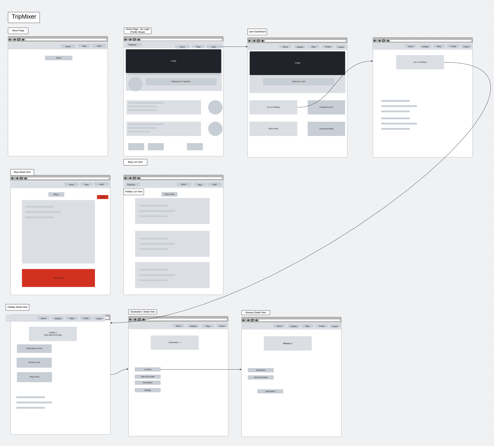
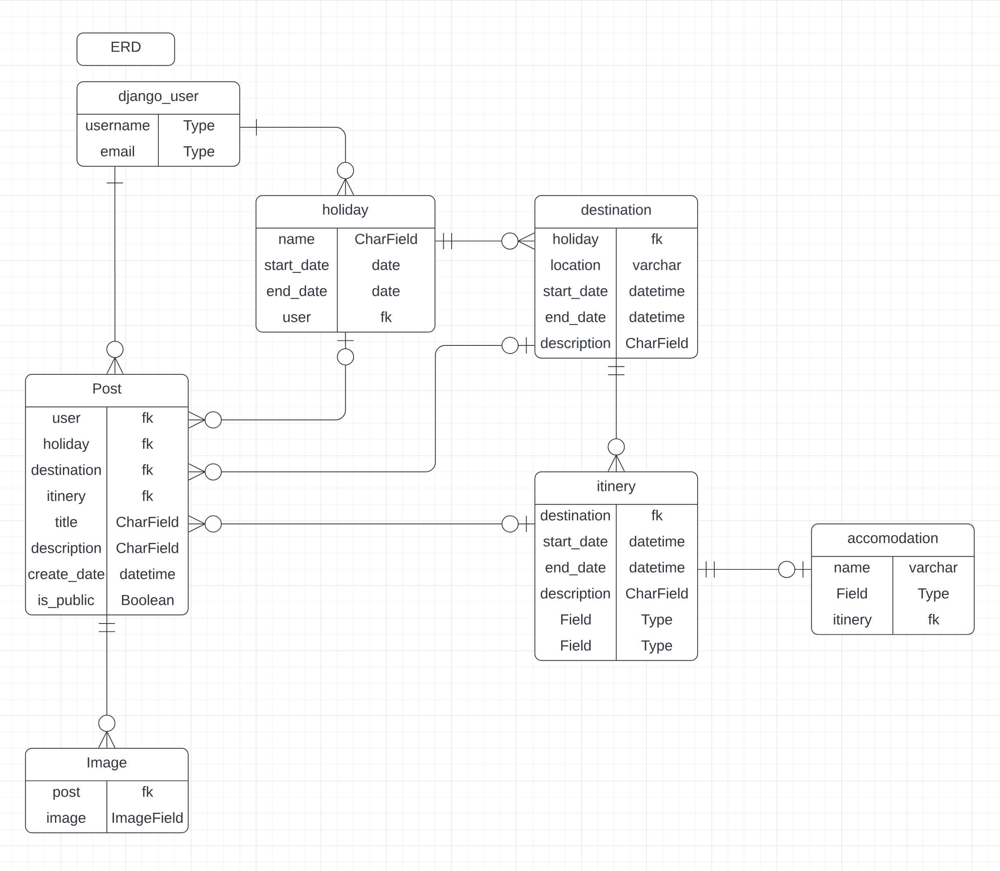
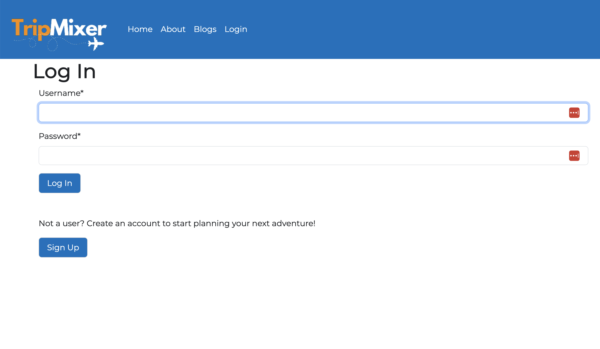
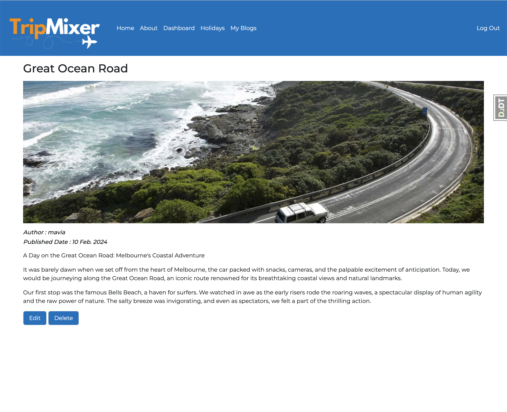

# ✈️ TripMixer ✈️

This is a group project where three team members collaborated to tackle various challenges, learning valuable lessons along the way.

## 🌏 Introduction

TripMixer is a robust fully responsive Full-Stack App built with HTML, CSS, Bootstrap5, Python, Django, PostgreSQL, Amazon S3, Docker and fly.io.
This app is ultimate gateway to crafting unforgettable journeys. With our intuitive platform, you can effortlessly plan your holiday, select your dream destinations, and tailor a custom itinerary that perfectly suits your travel style. But TripMixer is more than just a planning tool; it's a vibrant community of travelers.

## 🔎 Explore the App

Discover the refined version of the [TripMixer Travel App](https://sei-tripmixer.fly.dev/) now live on fly.io.

## 📝 Planning & Problem Solving 🚩

-   Laid out the ERD
-   Draw up wireframe
-   Set up Django Development Environment and Urls Path, Views and HTML templates
-   Work Individually on each views and urls as well as HTML templates
-   Regroup to deploy and/or solve coding issues

## 📷 App Screenshots

Login Page

Home Page

Dashboard

Blog

Mobile Views

## 🤖 Technology used:

-   Python
-   Django
-   PostgreSQL
-   Amazon S3
-   fly.io
-   Docker
-   HTML
-   CSS
-   Bootstrap5

## 💪 Challenges Faced and Conquered 💪

Despite the team project being less challenging than anticipated, we still encountered and overcame several hurdles together:

-   Collaborating effectively, managing merge conflicts, and maintaining alignment.
-   Learning to handle forms, especially for 'update' operations, and styling in class-based views.
-   Adding Bootstrap5 Modals on Edit and Add pages
-   Deploying the app on Fly.io.

## 🚀 Future features

-   Add 'Follow' button, so that a user can follow other users
-   Add location autofill features
-   Add features to let user see post from the one they are following
