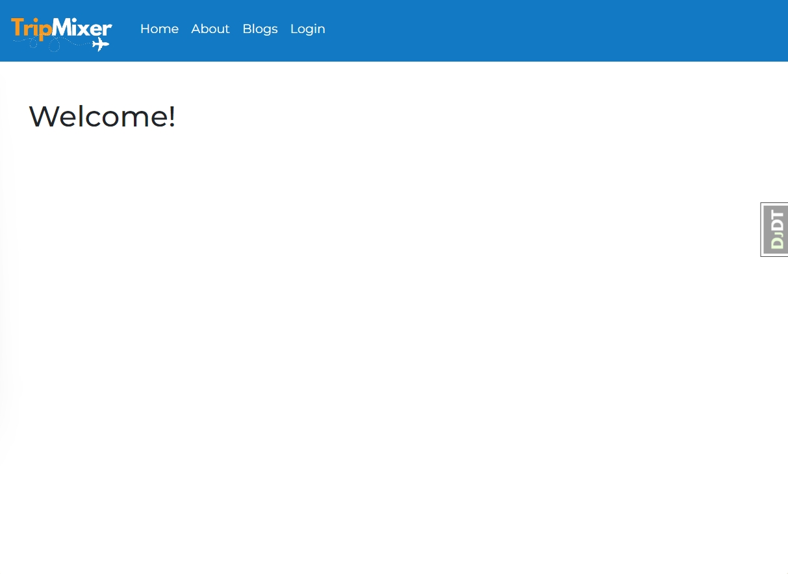
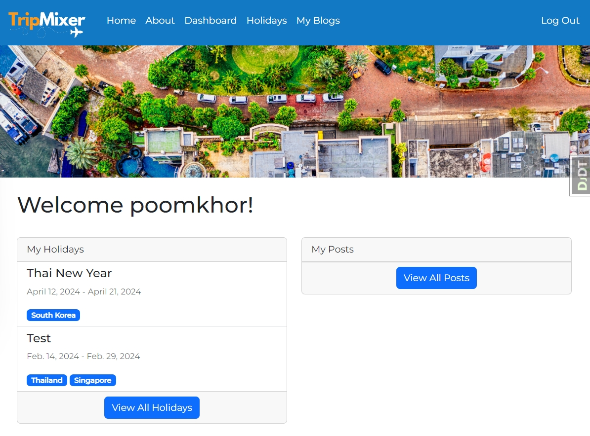

# TripMixer

## :page_facing_up: About

TripMixer is your ultimate gateway to crafting unforgettable journeys. With our intuitive platform, you can effortlessly plan your holiday, select your dream destinations, and tailor a custom itinerary that perfectly suits your travel style. But TripMixer is more than just a planning tool; it's a vibrant community of travelers.
Share your adventures in blog posts, discover new places through the experiences of others, and gather inspiration for your next escape. Whether you're a seasoned explorer or a first-time traveler, TripMixer makes it easy to navigate the world, one trip at a time.

Technology used includes:

-   Django
-   HTML
-   CSS
-   Bootstrap5

## :computer: Getting Started

[Click here](https://sei-tripmixer.fly.dev/) to see my live project!

## :pencil2: Planning & Problem Solving

-   Laid out the ERD
-   Draw up wireframe
-   Set up Django Development Environment and Urls Path, Views and HTML templates
-   Work Individually on each views and urls as well as HTML templates
-   Regroup to deploy and/or solve coding issues

## :scream: Bugs to fix :poop:

## :sob: Lessons learnt

-   Want users to be able to follow one another
-   Add location autofill features
-   Add features to let user see post from the one they are following

## :white_check_mark: Future features
